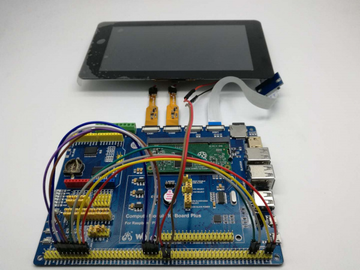

## Data Pretreatment

本專案主要用於雙目相機資料的獲取與處理以及深度圖的計算

### 設備：

-   raspberry pi CM3 - [Buy a Compute Module 3 – Raspberry Pi](https://www.raspberrypi.com/products/compute-module-3/)
-   Compute Module IO Board Plus - [Compute Module IO Board Plus - Waveshare Wiki](https://www.waveshare.net/wiki/Compute_Module_IO_Board_Plus)
-   IMX219-83 Stereo Camera - [IMX219-83 Stereo Camera - Waveshare Wiki](https://www.waveshare.net/wiki/IMX219-83_Stereo_Camera)
-   杜邦線*n

### 環境：

-   Python 3.5
    -   RPi.GPIO
    -   picamera
    -   i2cdriver/ smbus/ qwiic_icm20948
    -   glob
    -   numpy
-   ffmpeg
-   ？

### 樹莓派配置：

-   Compute Module 3/3 Lite/3+/3+ Lite镜像 (引自WAVESHARE 官網)
    链接：https://pan.baidu.com/s/16A7rscYvs1GuSurFdvKg8Q 密码：mgmn

-   攝像頭連接：

    -   GPIO0 <-> CD1_SDA

    -   GPIO1 <-> CD1_SCL

    -   GPIO4 <-> CAM1_IO1

    -   GPIO5 <-> CAM1_IO0

    -   =-=-=-=-=–=-=-=-=-=-=-=-=-=-=

    -   GPIO28 <-> CD0_SDA

    -   GPIO29 <-> CD0_SCL

    -   GPIO30 <-> CAM0_IO1

    -   GPIO31 <-> CAM0_IO0

    -   查看接入的相機畫面：

    -   ```powershell
        sudo raspivid -t 0 -cs 0
        sudo raspivid -t 0 -cs 1
        ```

    

-   連線

    註：相機連線到紅框區域，IMU連線到黃框區域


-   測試IMU Sensor
    -   進入“icm20948_h” 文檔，依照**readme.txt** 編譯運行

### 錄製雙目視頻：

1.   啟動樹莓派
2.   執行 >>> pip3 install -r requirments.txt
3.   執行 >>> python3 logVideo.py # 會直接進入等待錄製階段，可通過連接顯示屏觀察// 部分參數可進入文件直接修改
4.   按下靠近LED的第一個按鈕開始視頻錄製，同時LED燈會開始全亮
5.   再按一次，等待LED燈熄滅，停止錄製
6.   錄製文檔“*.h264”會儲存在 “raw” 文檔中
7.   執行 >>> python3 processSingleVideo.py #處理h264視頻文檔 轉MP4格式並切割視頻幀
8.   MP4文檔儲存在“reformat” 文檔中 // 視頻幀文檔儲存在“frames” 文檔中
     1.   如果根目錄下不存在“calibration.npy”文檔或更換了拍攝設備，需重新進行相機標定
     2.   將 « calibration.jpg » 列印並錄製視頻，按上述步驟在“frames”文檔中得到對應視頻幀文檔
     3.   將視頻幀文檔手動複製到“calibration”文檔中，執行後續步驟
9.   執行 >>> python3 binocular2depth.py 
     1.   該操作會先查看是否存在相機標定資訊“calibration.npy”
     2.   存在即直接進行後續步驟，不存在優先讀取“calibration”文檔內« left » « right »文檔資訊並標定
     3.   通過« CREStereo-Pytorch » 預估深度並儲存到« depth »文檔中，引用« models »文檔中的pth文檔預估深度。
          1.   如果需要通過視差圖方法獲取深度圖可參考 « binocular2disparity.py » 文檔
10.   得到深度圖僅供參考，如需實際運行建議通過openCV 手動調整深度圖到可實用格式

### IMU姿態估計：

1.   將IMU txt文檔放入« uny_data »中
2.   執行 >>> python3 imu.py

### References：

-   CREStereo-Pytorch: [ibaiGorordo/CREStereo-Pytorch: Non-official Pytorch implementation of the CREStereo(CVPR 2022 Oral). (github.com)](https://github.com/ibaiGorordo/CREStereo-Pytorch)
-   